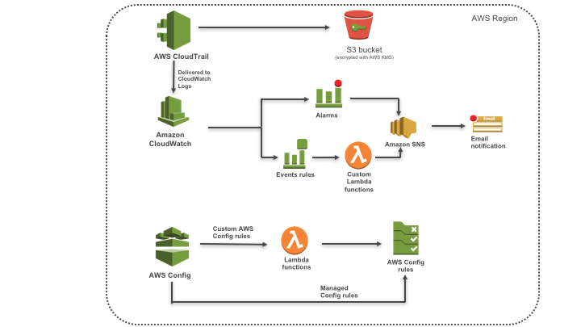
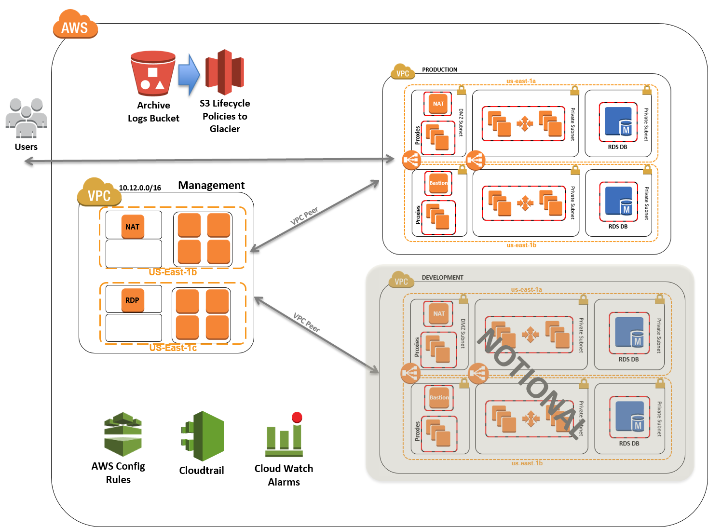
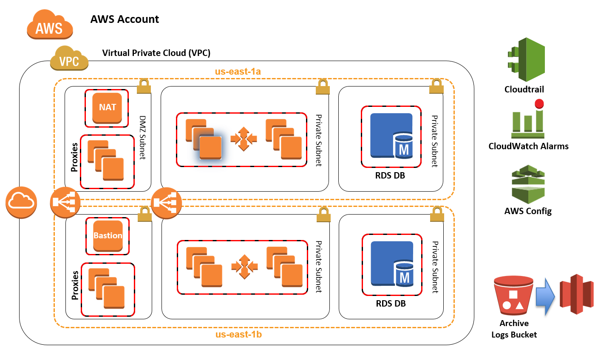

# Compliance as Code
This Repository deals with Architecture and Automation for achieving Continuous-Compliance in AWS Cloud

## CIS AWS Foundations Benchmark Compliance in the AWS Cloud

This Automation configures a standardized architecture for the Center for Internet Security (CIS) AWS Foundations Benchmark.

This Quick Start implements the CIS AWS Foundations Benchmark, which is a set of security configuration best practices for hardening AWS accounts, and provides continuous monitoring capabilities for these security configurations.

##### Architecture Overview

The script supports the CIScbenchmark by creating AWS Config rules, Amazon CloudWatch alarms, and CloudWatch Events rules in your AWS account. The deployment is automated by customizable AWS CloudFormation templates and scripts that build and configure the environment in about 10 minutes. The Quick Start also includes a security controls matrix (Microsoft Excel spreadsheet), which shows how the components and configuration map to CIS controls. For more information about the recommendations implemented by this Quick Start, see the [CIS AWS Foundations Benchmark specification](https://d0.awsstatic.com/whitepapers/compliance/AWS_CIS_Foundations_Benchmark.pdf) 

## Standardized Architecture for PCI DSS Compliance on the AWS Cloud

This script deploys a standardized environment that helps organizations with workloads that fall in scope for Payment Card Industry (PCI) Data Security Standard (DSS) compliance.

CF scripts will deploy a standard three-tier web architecture using multiple VPCs.

##### VPC Architecture

Refer Submodules for nested CF Template for base environment provisioning.
